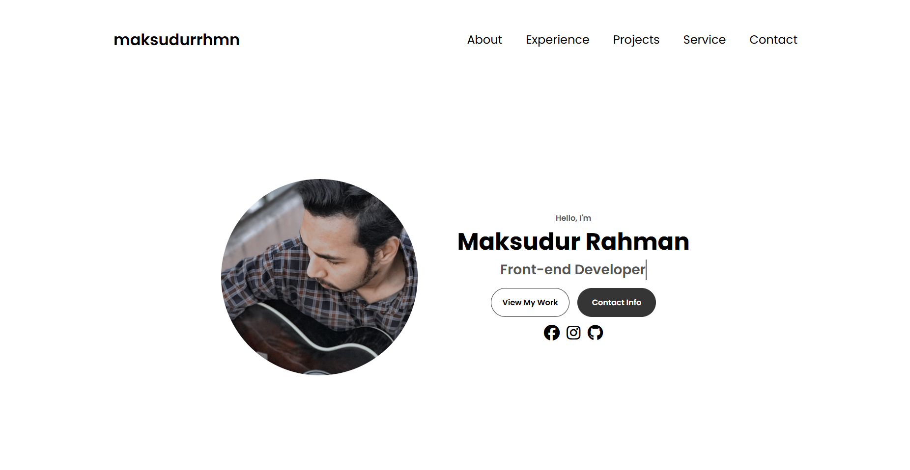
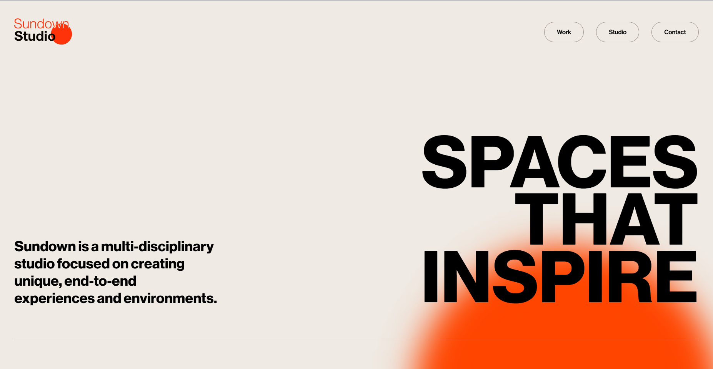
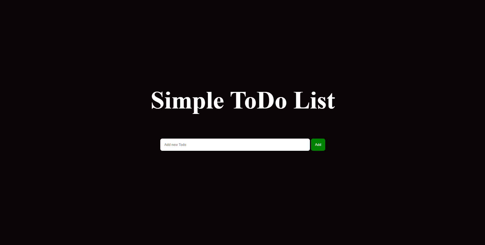

# Hi, I'm Maksudur Rahman 👋

---

## ⚡ About Me

I'm a passionate **Front-End Developer** focused on building **modern, responsive websites**.  
I enjoy turning **designs into pixel-perfect websites** and helping clients bring their ideas to life.

- 🌱 Currently improving my skills in **React.js**
- 💼 Available for freelance projects
- 📫 Reach me at: **maksudurrhmn2001@gmail.com**

---

## 🛠️ Skills

- **Front-End:** HTML, CSS, JavaScript, Bootstrap, Tailwind CSS
- **Design to Code:** Figma → HTML conversion
- **Tools:** Git, GitHub, VS Code, Chrome DevTools
- **Other:** Responsive Design, Mobile-Friendly Layouts

---

## 🧰 Tech Stack

  

---

# 🚀 Projects Showcase

<table>
  <tr>
    <td align="center" width="33%">
      
       
      <b>Portfolio Website</b>
       
      <a href="https://github.com/maksudurrhmn/Portfolio.git">GitHub Repo</a>
    </td>
    <td align="center" width="33%">
      
       
      <b>Sundown-Studio</b>
       
      <a href="https://github.com/maksudurrhmn/Sundown-Studio.git">GitHub Repo</a>
    </td>
    <td align="center" width="33%">
      
       
      <b>ToDo List</b>
       
      <a href="https://github.com/maksudurrhmn/ToDo-List.git">GitHub Repo</a>
    </td>
  </tr>
</table>

---

## 🔗 Social Profiles & Badges

---

## 📊 GitHub Stats & Language Usage

<table>
  <tr>
    <td align="center" width="50%">
      
    </td>
    <td align="center" width="50%">
      
    </td>
  </tr>
</table>

---

# 📈 GitHub Activity Graph

---

# 🐍 GitHub Contribution Snake

  <picture>
    <source media="(prefers-color-scheme: dark)" src="https://raw.githubusercontent.com/maksudurrhmn/maksudurrhmn/main/dist/github-snake-dark.svg">
    <source media="(prefers-color-scheme: light)" src="https://raw.githubusercontent.com/maksudurrhmn/maksudurrhmn/main/dist/github-snake.svg">
    
  </picture>

---

## ⚡ Fun Fact

"Turning coffee ☕ and ideas 💡 into clean, responsive websites!"

---

## 👀 Profile Visitors

